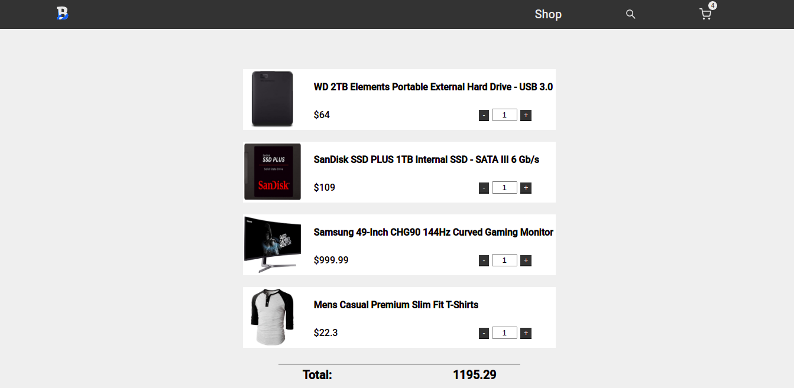

# Best 4 Buy

In this project I build a store page, with a cart, shop and search page.</br>
This project was part of my React studies, and this time I'm learning React Router and Styled Components. This application is a store like page with navigation routes, this is the power of React Router.</br>

## Demo
### Home Page
[Home page mobile demo](./demo/home_mobile.png) </br>

### Shop Page
[Shop page mobile demo](./demo/shop_mobile.png) </br>

### Search Page
[Search page mobile demo](./demo/search_mobile.png) </br>

### Cart Page

[Empty Cart page mobile demo](./demo/empty_cart_mobile.png) </br>

[Cart with products mobile demo](./demo/cart_mobile.png) </br>
If you want to give it a try click the link below: </br>
[Live Demo](https://gabriellima77.github.io/Best-4-Buy/)

## Getting started
If you want to use this app locally, follow the steps below: </br>
```
git clone git@github.com:gabriellima77/Best-4-Buy.git
cd Best-4-Buy
npm install
npm start
```

## Build with
- [React](https://reactjs.org/)
- [React Router](https://reactrouter.com/)
- [React Icons](https://react-icons.github.io/react-icons/)
- [Styled Components](https://styled-components.com/)
- [Fake Store Api](https://fakestoreapi.com/)